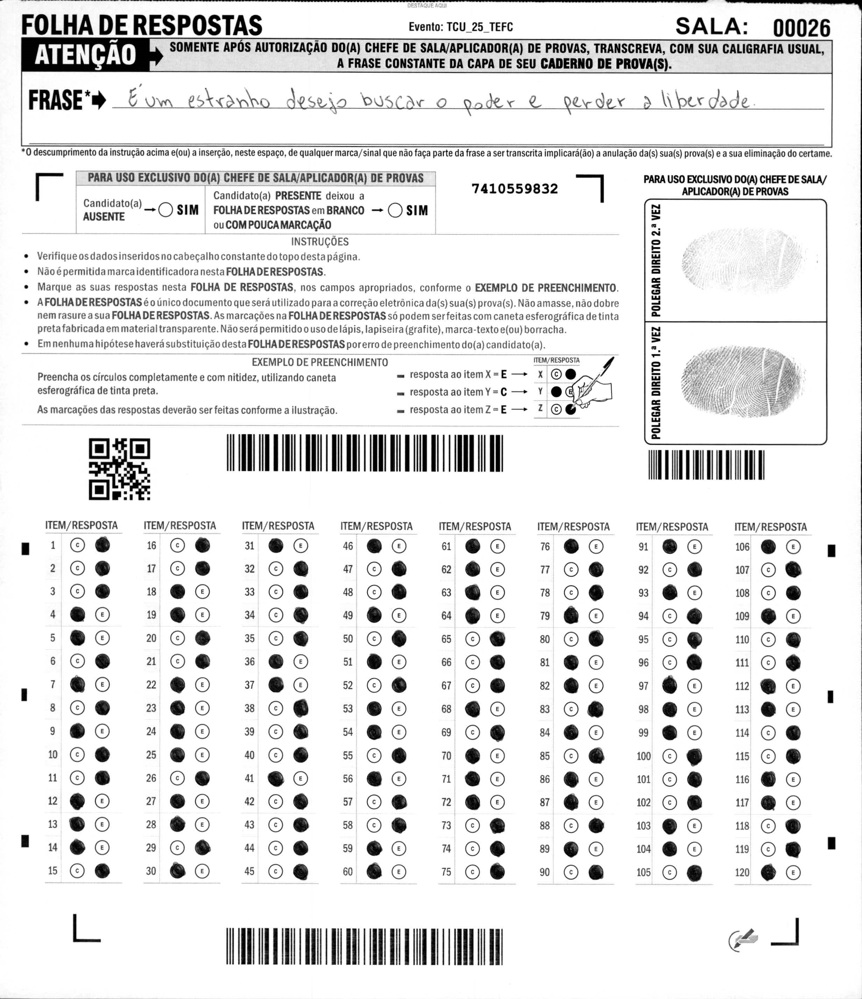

Texto CB1A1  
Em pleno momento de grandes transformações
político-sociais, na segunda metade da década de 1970, quando já
havia inclinações para a volta da democracia, o cantor e
compositor Belchior anunciava que “o passado é uma roupa que
não nos serve mais”. Os padrões de hoje já nos estabelecem
estilos e modelos diversos daqueles que um dia adotamos como
referência. Definitivamente, aquele que envergou a vestimenta
outrora usada já não é mais a mesma pessoa e qualquer tipo de
tentativa de reutilizá-la passará, necessariamente, pela realização
de ajustes que se amoldem ao instante presente.  
Velhos hábitos incorporados à nossa rotina devem,
periodicamente, ser revisitados, a fim de que se tornem
compatíveis com a realidade e a concretude do presente.
Se, antes, a vasta cabeleira podia ser repartida ao meio, dando a
quem a ostentava ares despojados e joviais, no tempo atual, para
muitos, a escassez capilar obriga a adaptar o penteado.
Nada adianta ficar de mal com a superfície que a imagem reflete.
De qualquer forma, nada ou ninguém passa incólume pela ação
do tempo, sem experimentar transformações de todas as
naturezas.  
Mudar é verbo que se conjuga em perfeita sintonia com
viver e, essencialmente, compõe rima exata com adaptar. Ao
descrever a teoria da evolução, Charles Darwin assentou que a
sobrevivência não é assegurada pelo emprego da força, mas
depende de mudanças adaptativas dos seres expostos às
transformações constantes (paulatinas ou abruptas) do ambiente
que os cerca.   
O contexto estampado veicula um paradoxo. Se, por um
lado, a marcha da mudança é via que não admite retorno,
permitindo apenas momentos de variações rítmicas dos passos,
mas sem nunca ser contida, por outro, ela aterroriza, chegando
quase a paralisar o paciente da mutação. No entanto, não é o
medo do escuro que vai impedir que a Terra gire, tampouco fará
que a luz solar tome o lugar da noite pouco iluminada.

_Fábio Túlio Filgueiras Nogueira. O tribunal de contas contemporâneo, o processo de transformação e a
pandemia. In: Edilberto Carlos Pontes Lima (coord.). Os tribunais de contas, a pandemia e o futuro do
controle. Belo Horizonte: Fórum, 2021, p. 245-254 (com adaptações)._  

Com base nas ideias do texto CB1A1, julgue os itens que se seguem.  
1 Por meio do trecho “mas depende de mudanças adaptativas
dos seres expostos às transformações constantes (paulatinas
ou abruptas) do ambiente que os cerca” (terceiro parágrafo),
o autor demonstra sua discordância parcial em relação à
teoria darwinista da evolução.
> 

2 De acordo com o texto, uma das transformações
político-sociais verificadas na segunda metade da década de
1970 diz respeito aos padrões da moda.
> Errado: O texto menciona que, na segunda metade da década de 1970, havia inclinações 
> para a volta da democracia (transformação político-social), mas os padrões da moda 
> são usados apenas como exemplo para ilustrar mudanças de comportamento e hábitos 
> ao longo do tempo, não como uma transformação político-social em si. Portanto, 
> o texto não afirma que uma das transformações político-sociais daquela época foi 
> relacionada à moda.

3 Infere-se do primeiro parágrafo que atualmente há maior
diversidade de estilos e modelos que na década de 1970.
> Certo: O texto afirma que "Os padrões de hoje já nos estabelecem estilos e modelos diversos
> daqueles que um dia adotamos como referência", o que implica que atualmente há uma
> maior diversidade de estilos e modelos em comparação com o passado, incluindo a década
> de 1970.

4 O paradoxo mencionado no parágrafo final do texto está no
fato de, por um lado, a marcha da mudança nunca ser
contida, e, por outro, ela quase paralisar o paciente da
mutação.
> Certo: O paradoxo mencionado no parágrafo final do texto reside na contradição 
> entre o fato de que a marcha da mudança é uma via que não admite retorno e 
> nunca pode ser contida, enquanto, por outro lado, essa mesma mudança pode aterrorizar 
> e quase paralisar o indivíduo que está passando por essa mutação. Portanto, o paradoxo 
> está na coexistência dessas duas realidades opostas.

5 Conclui-se do último período do texto que a sensação de
medo é inócua em relação à ocorrência de fatos que estão
fora do controle do indivíduo.
Julgue os itens a seguir, referentes a aspectos linguísticos e ao
vocabulário do texto CB1A1.
6 A correção gramatical do texto seria mantida caso o termo
“às”, em “às transformações constantes” (segundo período
do terceiro parágrafo), fosse substituído por a.
7 Caso o trecho “via que não admite retorno” (segundo
período do último parágrafo) fosse reescrito como via em
que não se admite retorno, a coerência das ideias do texto
seriam mantidas, embora fossem alteradas as relações
sintáticas entre os termos.
8 A correção gramatical e o sentido do texto seriam mantidos
se a forma verbal “estabelecem” (segundo período do
primeiro parágrafo) fosse substituída por impõe.
9 No trecho “já não é mais a mesma pessoa” (terceiro período
do primeiro parágrafo), a omissão da palavra “já” — não é
mais a mesma pessoa — ou da palavra “mais” — já não é a
mesma pessoa — não prejudicaria a coerência das ideias do
texto.
10 No terceiro período do primeiro parágrafo, o segmento “a
vestimenta outrora usada” funciona como sujeito da oração
cujo núcleo é a forma verbal “passará”.
11 Estaria mantida a correção gramatical do texto caso o
pronome “os”, em “os cerca” (final do terceiro parágrafo),
fosse empregado em posição enclítica, da seguinte forma:
cerca-os.
12 No primeiro período do segundo parágrafo, a expressão “a
fim de que” inicia oração que expressa a finalidade do que
foi afirmado anteriormente no período.
13 A palavra “incólume” (último período do segundo parágrafo)
está empregada com o mesmo sentido de inalterado.
14 A oração “que a sobrevivência não é assegurada pelo
emprego da força” (segundo período do terceiro parágrafo)
exerce sintaticamente a função de complemento da forma
verbal “assentou”.  

Julgue os seguintes itens de acordo com o Manual de Redação
da Presidência da República.

15 São características esperadas de um texto oficial a clareza, a
objetividade, a impessoalidade e a informalidade.
> Errado: As características esperadas de um texto oficial são a clareza, a objetividade, 
> a impessoalidade e a formalidade, e não a informalidade.  

16 Redação oficial é a maneira pela qual a população deve redigir comunicações 
para se dirigir formalmente à administração pública. 
> Errado: A redação oficial é a maneira pela qual a administração pública deve redigir
> comunicações formais, e não a população. Portanto, a afirmação está incorreta.

A new scholarship aimed at developing the next
generation of artificial intelligence “pioneers” will open to
applicants in spring 2026, with the first cohort beginning studies
the following autumn.
The Sparck AI scholarships, named after pioneering
British computer scientist Karen Sparck Jones, will give master’s
degree university students access to industry-leading firms as the
Government looks to boost the UK’s AI credentials.
The University of Bristol will be one of nine universities
to offer the fully-funded Government scholarship, alongside
faculties in Newcastle, Manchester and Edinburgh.
The scheme has been developed in line with the
Government’s “AI Opportunities Action Plan”, receiving more
than £17 million of funding from Westminster, with the grant
covering both students’ tuition and living costs.
Alongside master’s places, 100 scholars will receive
placements in leading AI companies, as well as mentorship from
industry experts. It is hoped the scholarships will give students
“unparalleled access” to the fast-moving industry.
Vice-Chancellor Evelyn Welch said the scholarships
would give Bristol the chance to “explore bold new ideas and
nurture exceptional talent.” Technology Secretary Peter Kyle MP
said he believed the scheme would help students secure “highly
skilled jobs” and build “a workforce fit for the future.” AI talent
acquisition firm Beamery said the scholarships would help their
goal to create “equal access to work” and connect “talent to
opportunity”.
Internet: <www.bbc.com> (adapted).
About the ideas and the linguistic aspects of the previous text,
judge the following items.
17 The text suggests that the scholarship scheme will ultimately
pave the way for strengthening links between academic
research and practical applications.
18 The phrase “industry-leading firms” (second paragraph)
could appropriately be replaced with leading industrial
companies, as both convey equivalent meanings.
19 According to the text, one of the anticipated outcomes of the
scholarship initiative is helping scholars obtain stable,
specialised jobs.
20 The text mentions that the financial subsidy supporting the
scholarship scheme is going to be refundable.
21 In the sentence “It is hoped the scholarships will give
students ‘unparalleled access’ to the fast-moving industry”
(second sentence of the fifth paragraph), the pronoun “It”
refers back to the word “mentorship”, mentioned in the
previous sentence.
22 In the fragment ‘unparalleled access’ (second sentence of the
fifth paragraph), the word “unparalleled” could be replaced
with unmatched without altering the meaning of the phrase.
23 It can be inferred from the text that the new scholarship
scheme will undoubtedly achieve its goal of developing the
next generation of AI groundbreakers.

---

Acerca da ordem social no Estado constitucional democrático, julgue os itens a seguir.

24 As condutas e atividades consideradas lesivas ao meio
ambiente sujeitam os infratores, pessoas físicas ou jurídicas,
a sanções penais e administrativas, independentemente da
obrigação de reparar os danos causados.
> Certo: De acordo com o artigo 225, §3º, da Constituição Federal de 1988, 
> as condutas e atividades consideradas lesivas ao meio ambiente sujeitam os 
> infratores, pessoas físicas ou jurídicas, a sanções penais e administrativas, 
> independentemente da obrigação de reparar os danos causados. 
> Portanto, a afirmação está correta.

25 Ao reconhecer aos povos indígenas sua organização social,
costumes, línguas, crenças e tradições, bem como os direitos
originários sobre as terras que tradicionalmente ocupam, a
Constituição Federal de 1988 assegura aos povos indígenas
direitos fundamentais, com as consequentes garantias
inerentes à sua proteção, quais sejam, cláusulas pétreas,
anteparo em face de maiorias eventuais, interpretação
extensiva e vedação ao retrocesso.
> Errado: Embora a Constituição Federal de 1988 reconheça e assegure diversos direitos
> aos povos indígenas, tais direitos não são considerados cláusulas pétreas. As cláusulas
> pétreas são aquelas que não podem ser alteradas por emendas constitucionais, e
> os direitos dos povos indígenas não se enquadram nessa categoria. Portanto, a
> afirmação está incorreta.

26 O procedimento administrativo demarcatório possui natureza
constitutiva, razão pela qual ele confere aos povos indígenas
a titularidade definitiva dos direitos territoriais.
> Errado: O procedimento administrativo demarcatório possui natureza
> declaratória, e não constitutiva, pois ele apenas reconhece a titularidade
> dos direitos territoriais dos povos indígenas, sem conferi-los de forma
> definitiva. Portanto, a afirmação está incorreta.

27 São consideradas cruéis, para fins de proteção constitucional
ao meio ambiente, manifestações culturais com animais
registradas como bem de natureza imaterial integrante do
patrimônio cultural brasileiro, ainda que haja lei específica
que garanta o bem-estar dos animais envolvidos nessas
práticas.
> Errado: De acordo com o artigo 225, §1º, inciso VII, da Constituição Federal de 1988,
> são consideradas cruéis, para fins de proteção constitucional ao meio ambiente,
> manifestações culturais com animais, mesmo que haja lei específica que garanta o
> bem-estar dos animais envolvidos nessas práticas. Portanto, a afirmação está incorreta.

28 Ao conferir à coletividade o direito-dever de tutelar e
preservar o meio ambiente ecologicamente equilibrado, a
Constituição Federal de 1988 exige a participação popular na
administração desse bem de uso comum e de interesse de
toda a sociedade.
> Certo: A Constituição Federal de 1988, em seu artigo 225, §1º, inciso IV, confere à coletividade o direito-dever de tutelar e preservar o meio ambiente
ecologicamente equilibrado, exigindo a participação popular na administração desse bem de uso comum e de interesse de toda a sociedade. Portanto, a afirmação está correta.

Em relação a direitos e deveres individuais e coletivos, direitos
sociais, nacionalidade, cidadania, direitos políticos e partidos
políticos, julgue os itens que se seguem.

29 É vedada a cassação de direitos políticos, mas não sua perda
ou suspensão.
> Errado: De acordo com o artigo 15 da Constituição Federal de 1988,
> é vedada a cassação de direitos políticos, mas é possível a perda ou suspensão
> desses direitos em determinadas circunstâncias previstas na Constituição. Portanto,
> a afirmação está incorreta.

30 A suspensão dos direitos políticos caracteriza-se pela
temporariedade, pois é possível que o titular volte a
exercê-los no futuro, enquanto a perda desses direitos é
definitiva, sem possibilidade de reaquisição.
> Certo: A suspensão dos direitos políticos é temporária, permitindo que o titular
> volte a exercê-los após o período determinado. Por outro lado, a perda dos direitos
> políticos é definitiva, sem possibilidade de reaquisição. Portanto, a afirmação está correta.

31 A soberania popular é exercida pelo sufrágio universal e pelo
voto direto, secreto, obrigatório e com valor igual para todos,
características estas protegidas por cláusula pétrea.
> Certo: A soberania popular é exercida pelo sufrágio universal e pelo voto direto, secreto, obrigatório e com valor igual para todos,
> conforme estabelecido na Constituição Federal de 1988. Essas características são protegidas por cláusula pétrea, o que significa que não podem ser alteradas por emendas constitucionais.

32 A admissão, pelo Supremo Tribunal Federal, das
candidaturas avulsas para eleições majoritárias justifica-se
em razão de a filiação partidária não ser constitucionalmente
prevista como condição de elegibilidade.
> 

33 Todos podem reunir-se pacificamente, sem armas, em locais
abertos ao público, ~~desde que previamente autorizados pela
autoridade competente~~ e desde que não frustrem outra
reunião anteriormente convocada para o mesmo local. 
> Errado: De acordo com o artigo 5º, inciso XVI, da Constituição Federal de 1988,
> todos podem reunir-se pacificamente, sem armas, em locais abertos ao público,
> independentemente de autorização prévia, desde que não frustrem outra reunião
> anteriormente convocada para o mesmo local. Portanto, a afirmação está incorreta.

| Cargo                   | Quantidade de Inscritos |
|-------------------------|-------------------------|
| Analista de TI          | 120                     |
| Administrador de Redes  | 85                      |
| Desenvolvedor Java      | 200                     |
| Suporte Técnico         | 65                      |
| Segurança da Informação | 90                      |
| Total                   | 560                     |

Com base na planilha precedente, elaborada no MS Excel 365,
julgue o próximo item.
34 A fórmula a seguir retorna 185, que corresponde à soma de
inscritos apenas nos cargos Analista de TI e
Suporte Técnico.
=SOMAR(FILTRAR(B2:B6;(A2:A6=“Suporte
Técnico”)+(A2:A6=“Analista de TI”)))
A respeito do Google Chrome, de redes sociais, de modelos de
computação em nuvem e do gerenciamento de pastas e arquivos
no Windows, julgue os itens a seguir.
35 Redes sociais como o Instagram utilizam algoritmos que se
baseiam no histórico de interações para personalizar o feed
dos usuários, sem influência de anúncios pagos.
36 No Windows, a estrutura hierárquica de pastas permite o
gerenciamento de permissões de acesso de forma
independente para cada subpasta, inclusive dentro de
um mesmo diretório.
37 Com o Google Chrome, é possível instalar extensões como
tradutores ou bloqueadores de anúncios e sincronizar os
favoritos do usuário em qualquer dispositivo com uma conta
Google.
38 No modelo de computação em nuvem SaaS (software as a
service), o consumidor tem controle sobre a infraestrutura de
rede, os servidores e o sistema operacional, sendo
responsável pela instalação, configuração e manutenção das
aplicações fornecidas pelo provedor.
A respeito de procedimentos de backup e armazenamento de
dados em nuvem (cloud storage), julgue os itens subsecutivos.
39 O armazenamento de dados em nuvem elimina os riscos de
segurança que normalmente ocorrem em ambientes
tradicionais, como ameaças internas, violação e perda de
dados, phishing, malware, ataques DDoS e APIs
vulneráveis.
40 No âmbito da administração pública, é recomendável que o
armazenamento de backups de dados críticos seja realizado
preferencialmente em infraestrutura interna à organização, de
modo a garantir maior controle físico e facilitar a
recuperação imediata dos dados em caso de falhas locais.
Com fundamento no Regimento Interno do TCU (Resolução
TCU n.º 155/2002), julgue os itens que se seguem, referentes aos
órgãos do tribunal e a competências.
41 O presidente do TCU pode delegar algumas de suas
atribuições administrativas, como, por exemplo, a assinatura
de acordos de cooperação e a publicação do relatório de
gestão fiscal exigido pela Lei de Responsabilidade Fiscal.
42 Cada câmara do TCU será composta por quatro ministros,
indicados pelo presidente do tribunal, sendo possível a
permuta ou remoção deles, a pedido dos próprios, para outra
câmara, desde que haja a anuência do Plenário.
43 Compete ao Plenário do TCU deliberar sobre o relatório de
auditoria operacional, bem como sobre a prestação e tomada
de contas especial.
Com base no que o Regimento Interno do TCU dispõe acerca do
processo em geral, do controle externo e dos instrumentos de
fiscalização, julgue os itens subsecutivos.
44 No caso de contas julgadas irregulares, a decisão definitiva
publicada constituirá a obrigação do responsável de
comprovar, no prazo de trinta dias, perante o TCU, o
pagamento da quantia correspondente ao débito que lhe tiver
sido imputado ou da multa cominada.
45 No caso de empate em julgamento no Plenário, o processo
será retirado de pauta e reincluído na próxima sessão,
cabendo ao ministro relator adotar medidas para que o
colegiado esteja composto com a totalidade do quórum de
nove ministros ou ministros-substitutos convocados, aptos a
votar, reiniciando-se, assim, a votação.
46 As provas produzidas pelas partes devem ser apresentadas,
sempre que possível, de forma documental, inclusive as
declarações pessoais de terceiros.
47 A falta de manifestação do Ministério Público em processo
no qual a sua intervenção seja obrigatória gera nulidade a
partir do momento em que esse órgão deveria ter-se
pronunciado.
48 Quando houver mais de um responsável pelo mesmo fato, a
defesa apresentada por um deles aproveitará a todos, mesmo
ao revel, no que concerne às circunstâncias objetivas, e não
aproveitará no tocante aos fundamentos de natureza
exclusivamente pessoal.
49 Não é admitida sustentação oral no julgamento de agravo e
de medida cautelar.
50 A auditoria é o instrumento destinado a subsidiar a
apreciação dos atos sujeitos a registro, suprir omissões e
lacunas de informações, esclarecer dúvidas e apurar
denúncias ou representações.

1 2 3 4 5 6 7 8 9 10 11 12 13 14 15 16 17 18 19 20
E E E C C C X E C E E C C C E E C E X E
21 22 23 24 25 26 27 28 29 30 31 32 33 34 35 36 37 38 39 40
E C E C C E E C C E E E E X E C C E E X
41 42 43 44 45 46 47 48 49 50 0 0 0 0 0 0 0 0 0 0
E C E E E C C C C E 

---

Acerca das abordagens teóricas da administração e da evolução
da administração pública no Brasil, julgue os seguintes itens.
51 A primeira experiência de reforma de longo alcance da
administração pública brasileira originou a criação do
Departamento Administrativo do Serviço Público (DASP),
que funcionava apenas no âmbito da União, sem
interferência ou influência nas unidades federadas.
52 Dentro de um sistema burocrático, a mudança deve operar-se
de baixo para cima e ser universal, isto é, deve afetar o
conjunto da organização como um todo.
53 O Plano Diretor da Reforma do Aparelho do Estado tinha
como proposta explícita inaugurar a chamada administração
gerencial e partia da premissa de que a crise latino-americana
era uma crise do Estado.
54 A autoridade legal, típica da organização burocrática, é um
tipo de dominação legítima que depende da criação de
normas legais no seio de um grupo e do acordo entre os
membros do grupo para sujeitá-los aos ditames do sistema
legal.
A respeito da gestão de processos, gestão da qualidade e modelos
de excelência gerencial, julgue os itens subsecutivos.
55 A estratégia da melhoria contínua da gestão, também
conhecida como melhoria contínua ou ciclo PDCA, baseia-se
em uma atividade cíclica e constante que segue estas quatro
etapas consecutivas: elaboração do plano de melhoria da
gestão; avaliação da gestão; acompanhamento e avaliação do
plano de melhoria da gestão; e reavaliação da gestão.
56 São marcos da evolução do programa GESPÚBLICA desde
a sua concepção em 1990: o subprograma da Qualidade e
Produtividade na Administração Pública, focado na gestão
de processos; o Programa da Qualidade e Participação na
Administração Pública, com maior atenção à gestão de
resultados; o Programa da Qualidade do Serviço Público,
voltado à qualidade do atendimento ao cidadão; e o
Programa Nacional de Gestão Pública e Desburocratização,
cujo objeto principal é a gestão por resultados orientada ao
cidadão.
57 BPMN (Business Process Modeling Notation) é um padrão
para a modelagem de processos que possui um modelo único
de diagrama no qual estão dispostos apenas quatro elementos
de modelagem: atividades, eventos, decisões e rotas.
58 No BPMN (Business Process Modeling Notation), a figura
de um círculo representa uma atividade, que consiste no
trabalho a ser executado em um processo, enquanto a figura
de um losango representa um evento, ou seja, algo que
ocorre durante um processo.
59 Segundo Luiz Carlos Bresser-Pereira, protagonista da
implementação da nova administração pública no Brasil,
esse novo modelo se diferencia da administração pública
burocrática por seguir princípios do gerencialismo, visando,
entre outros objetivos, à melhoria das decisões estratégicas
do governo e da burocracia e à garantia da democracia por
meio da prestação de serviços públicos orientados para o
cidadão-cliente e controlados pela sociedade.
Em relação ao levantamento de estilos motivacionais, julgue os
itens a seguir.
60 Para as pessoas cujo principal norteador de comportamento
motivacional é o da ação, é importante ter autonomia, porém
elas não se sentem motivadas quando desafiadas a
comprovar a própria eficiência ou quando postas para
desenvolver atividades variadas.
61 Para os indivíduos com orientação motivacional
participativa, a promoção do desenvolvimento dos talentos
das pessoas com as quais trabalha consiste em situação
geradora de satisfação, enquanto o tratamento impessoal se
traduz em insatisfação motivacional.
Julgue os itens subsequentes, relativos à função de controle na
administração pública e à gestão de projetos.
62 Em alguns ambientes de projeto, o cliente ou usuário final se
envolve com a equipe do projeto para revisão e feedback
periódicos.
63 Tendo em vista que as organizações esperam que os projetos
entreguem resultados, além de produtos e artefatos, os
gerentes de projeto devem entregar projetos que criem valor
para a organização e as partes interessadas, no contexto do
sistema por entrega de valor da organização.
64 O controle deve ser desenvolvido por todos os órgãos do
aparelho do Estado e pela iniciativa privada, quando no
exercício de função estatal, mesmo que em regime de
colaboração.
65 Uma estrutura adequada de controle pode prescindir da ação
individual do cidadão, desde que seu sistema esteja bem
consistente e preparado para o exercício de tal função.
Caio apresentou requerimento administrativo perante
determinada autarquia federal. No exercício de seu cargo
comissionado, João, autoridade competente para a prática do ato,
manteve-se inerte, gerando, assim, prejuízo a Caio, que, então,
ajuizou ação judicial, requerendo indenização pelo prejuízo
causado em virtude da omissão de João.
A partir dessa situação hipotética, julgue os itens seguintes.
66 A possibilidade de responsabilização do Estado por atos
praticados por seus agentes públicos no exercício da função
não alcança os atos omissivos.
67 Se Caio promover ação judicial de obrigação de fazer em
face da autarquia federal com o objetivo de ser
providenciada a resposta ao requerimento apresentado na
esfera administrativa, essa medida, caso julgada procedente,
resultará em controle administrativo.
68 Autarquia é entidade descentralizada da administração
pública indireta com personalidade jurídica de direito
público.
69 Dada a presunção de legitimidade e veracidade dos atos
administrativos, cabe a Caio o ônus de comprovar o alegado
prejuízo decorrente da omissão de João.
70 Ato comissivo ou omissivo de João é considerado ato
administrativo, mesmo que ele não exerça cargo público
efetivo. 

Devido a inviabilidade de competição, determinado
Ministério de Estado realizou a contratação direta de empresa
privada para prestação de serviços. No decorrer da execução do
contrato, a empresa descumpriu cláusula contratual, o que foi
comprovado em processo administrativo, e foi-lhe aplicada multa
contratual, mas ela apresentou recurso, alegando ausência de
contraditório. Foi negado provimento a tal recurso, então a
empresa interpôs novo recurso, dirigido à autoridade superior da
autoridade julgadora.
Considerando essa situação hipotética, julgue os itens que se
seguem.
71 A aplicação da multa contratual configura exercício do poder
administrativo disciplinar.
72 A apreciação do segundo recurso representa controle
administrativo fundamentado no poder hierárquico.
73 No caso, a contratação direta deve ter sido realizada por
dispensa de licitação.
74 Ministério de Estado é órgão público sem personalidade
jurídica.
75 A apreciação do primeiro recurso administrativo apresentado
pela empresa contratada configura exercício do poder de
polícia administrativo.
Determinado órgão público federal celebrou contrato
administrativo com entidade dotada de personalidade jurídica de
direito privado cujo capital social é integralmente público, para
contratação de obras e serviços especiais de engenharia. O
critério de julgamento das propostas foi o de maior desconto, e a
análise das propostas foi feita de forma técnica e imparcial, com
base em critérios objetivos.
Em relação a essa situação hipotética, julgue os próximos itens.
76 A análise das propostas feita de forma imparcial e técnica
baseia-se no princípio do julgamento objetivo.
77 Maior desconto é o critério de julgamento das propostas
destinadas a contratos de eficiência, em que o contratado
busca gerar economia para a administração pública.
78 O órgão público que firmou o contrato integra a estrutura
desconcentrada da administração pública federal.
79 A modalidade de licitação mais adequada à hipótese é o
pregão.
80 O contrato foi celebrado com sociedade de economia mista.
À luz do disposto na Lei n.º 14.133/2021, julgue os itens que se
seguem.
81 O princípio da motivação nas licitações públicas associa-se à
necessidade de se substituírem a improvisação e o empirismo
por métodos planejados e testados, com vistas à otimização
do uso de recursos e à minimização de riscos.
82 Embora não se aplique à concessão e permissão de uso de
bens públicos, a referida lei é aplicável à alienação e
concessão de direito real de uso de bens.
Com base na Instrução Normativa n.º 5/2017 da Secretaria de
Gestão do então Ministério do Planejamento, Desenvolvimento e
Gestão, julgue os itens seguintes.
83 Na contratação de instituição sem fins lucrativos, o serviço
contratado deve ser executado obrigatoriamente pelos
profissionais integrantes dos quadros funcionais da
instituição.
84 É vedada aos servidores públicos a prática de atos de
ingerência na administração da contratada, a exemplo do
direcionamento da contratação de pessoas para a composição
de sua equipe de trabalho.
Julgue os itens subsequentes, acerca do acompanhamento de
execução dos contratos administrativos.
85 Para definir a produtividade de referência contratual, deve-se
atentar para os fatores que estejam fora do controle do
prestador e que possam interferir no atendimento das metas,
bem como para o uso de indicadores complexos e
sobrepostos.
86 A execução dos contratos deve ser acompanhada e
fiscalizada por meio de instrumentos de controle que
compreendam os recursos humanos empregados em função
da quantidade e da formação profissional exigidas.
A respeito dos papéis do fiscalizador do contrato e do preposto da
contratada, julgue os itens a seguir.
87 Conforme a natureza dos serviços, pode-se exigir a
manutenção do preposto da contratada no local da execução
do objeto, bem como estabelecer sistema de escala semanal
ou mensal.
88 Para o exercício da função de fiscalização, são suficientes as
cópias dos estudos preliminares, do edital e seus anexos,
fornecidos pelo setor de licitação e contratos da organização
aos fiscais do contrato.
Julgue os próximos itens, em relação ao registro e notificação de
irregularidades e aplicação de penalidades e sanções
administrativas.
89 O descumprimento das obrigações trabalhistas ou a não
manutenção das condições de habilitação pela contratada
pode ensejar a rescisão contratual, sem prejuízo das demais
sanções.
90 Em caso de indício de irregularidade no recolhimento da
contribuição para o FGTS, os fiscais ou gestores de contratos
de serviços com regime de dedicação exclusiva de mão de
obra devem oficiar, precipuamente, o Ministério da Fazenda.
Durante auditoria realizada pelo TCU em determinado
órgão federal, foram analisados os demonstrativos fiscais
referentes ao exercício de 2024. Os dados apresentados indicaram
receita corrente líquida de R$ 100 milhões, receitas primárias
totais de R$ 95 milhões, despesas primárias de R$ 88 milhões,
receitas de operações de crédito de R$ 8 milhões e despesas com
juros e encargos da dívida de R$ 4 milhões.
Considerando a situação hipotética precedente, julgue os itens
subsequentes.
91 De acordo com a metodologia “abaixo da linha” para a
apuração do resultado fiscal, considera-se a variação da
dívida fiscal líquida, sendo esta necessariamente equivalente
ao resultado obtido pela metodologia “acima da linha”
quando não há discrepâncias estatísticas.
92 Para fins de cálculo do resultado primário pelo método
“acima da linha”, devem ser consideradas exclusivamente as
receitas e despesas primárias, sendo vedada a inclusão de
receitas de operações de crédito no cômputo.
93 O resultado nominal do órgão, considerados o superávit
primário e as despesas com juros, apresentou déficit de
R$ 3 milhões, o que indica aumento do endividamento
líquido.
94 Segundo a Lei de Responsabilidade Fiscal, o resultado
primário mínimo deve ser fixado na lei de diretrizes
orçamentárias, podendo ser alterado durante o exercício
mediante justificativa técnica e aprovação do Poder
Legislativo. 

Julgue os itens seguintes, à luz das normas de execução
orçamentária.
95 A liquidação da despesa somente poderá ser efetivada após a
verificação do direito adquirido pelo credor, mediante
apresentação dos documentos comprobatórios da entrega dos
bens conforme especificações contratuais.
96 O empenho da despesa deve ocorrer obrigatoriamente antes
da realização do procedimento licitatório, garantindo-se a
reserva orçamentária necessária para o cumprimento da
obrigação assumida.
97 Caso seja identificado erro no valor empenhado, sendo este
superior ao valor da obrigação efetivamente assumida,
deve-se proceder ao cancelamento parcial do empenho, com
a consequente liberação do saldo orçamentário excedente.
Durante análise das contas anuais de determinado órgão
federal, o TCU constatou a existência de empenhos não
liquidados em 31 de dezembro de 2024, no valor total de
R$ 2.500.000, bem como despesas relativas a exercícios
anteriores que não foram adequadamente processadas. A
administração apresentou justificativas técnicas para a
manutenção de parte desses valores como restos a pagar.
Com base nessa situação hipotética e na legislação aplicável,
julgue os itens a seguir.
98 Despesas de exercícios anteriores devidamente reconhecidas
e processadas conforme legislação específica podem ser
pagas à conta de dotações orçamentárias vigentes, desde que
classificadas no elemento de despesa apropriado.
99 O cancelamento de restos a pagar por insuficiência de
dotação orçamentária constitui receita orçamentária do
exercício em que ocorrer, devendo ser registrado como
receita de capital quando originário de despesas de
investimento.
100 A prescrição quinquenal dos restos a pagar não processados
implica automaticamente a extinção da obrigação pelo ente
público, vedada qualquer forma de pagamento posterior.
101 Os empenhos não liquidados até 31 de dezembro e que
atendam aos requisitos legais de validade devem ser
automaticamente inscritos em restos a pagar não
processados, independentemente de análise individual da
administração.
Julgue os próximos itens, tendo como base as normas de controle
interno.
102 A responsabilidade solidária entre o ordenador de despesa e
o responsável pela conformidade documental subsiste por
prazo de dez anos, contados da data da aprovação das contas
pelo órgão de controle externo competente.
103 A ausência de conformidade documental em processo de
despesa constitui irregularidade que impede o
prosseguimento da execução, devendo ser sanada antes da
efetivação do pagamento ao credor.
104 O rol de responsáveis deve ser mantido permanentemente
atualizado, incluindo-se todos os ordenadores de despesa e
demais servidores com atribuições relacionadas à gestão de
recursos públicos.
105 A conformidade documental deve ser atestada diariamente
pelo responsável designado, abrangendo todos os
documentos de receita e despesa processados no período,
sendo vedada a delegação dessa atribuição.
Acerca do conceito, tipos e formas de controle, julgue os itens a
seguir.
106 O controle concomitante ocorre durante a execução de um
ato ou processo administrativo, tendo como principal
vantagem a possibilidade de correção de rumos antes da sua
finalização, o que minimiza danos e irregularidades.
107 O controle de mérito, também conhecido como controle de
conveniência e oportunidade, é diretamente exercido tanto
pelo controle interno quanto pelo controle externo, sendo-lhe
pertinente a revisão de atos discricionários da administração
pública.
108 O controle interno é prerrogativa exclusiva do
Poder Judiciário, visando à regularidade e eficiência de suas
atividades.
Julgue os itens subsequentes, relativos ao controle parlamentar e
ao controle administrativo.
109 O controle administrativo, inerente à própria administração
pública, pode ser exercido de ofício ou mediante provocação
de terceiros e abrange tanto a análise de legalidade quanto a
de mérito do ato ou da conduta administrativa.
110 Dado o princípio da autotutela, que embasa o controle
administrativo, a administração pública tem o poder-dever de
anular seus próprios atos eivados de ilegalidade, mas não de
revogá-los por motivo de conveniência ou oportunidade.
111 A instalação de comissão parlamentar de inquérito (CPI) no
âmbito do Congresso Nacional exige a aprovação da maioria
absoluta dos membros de cada uma das casas (Câmara dos
Deputados e Senado Federal), além da indicação de fato
determinado e prazo certo de duração.
112 Uma das prerrogativas do Congresso Nacional, no exercício
do controle externo, é a possibilidade de sustar atos
normativos do Poder Executivo que exorbitem do poder
regulamentar ou dos limites de delegação legislativa.
Julgue os próximos itens, relacionados ao contencioso
administrativo e ao sistema de jurisdição una.
113 A criação de um tribunal administrativo com poder de
julgamento definitivo, cuja decisão impedisse a revisão
judicial sobre o mérito do ato, seria compatível com o
sistema brasileiro de controle da administração pública,
desde que a Constituição Federal fosse alterada para prever
expressamente essa competência excepcional.
> Errado: No sistema brasileiro de jurisdição una, o Poder Judiciário detém a competência exclusiva para o julgamento definitivo das questões relativas ao mérito dos atos administrativos.
> A criação de um tribunal administrativo com poder de julgamento definitivo sobre o mérito do ato seria incompatível com o sistema jurídico brasileiro, mesmo que a Constituição Federal fosse alterada para prever essa competência excepcional.
> Portanto, a afirmação está incorreta. 

114 No sistema brasileiro de jurisdição una, a existência de um
processo administrativo prévio e exauriente, com trânsito em
julgado na esfera administrativa, impede a posterior
apreciação da matéria pelo Poder Judiciário, ressalvadas as
hipóteses de vícios insanáveis de legalidade.
> Errado: No sistema brasileiro de jurisdição una, o Poder Judiciário detém a competência exclusiva para o julgamento definitivo das questões relativas ao mérito dos atos administrativos.
> A existência de um processo administrativo prévio e exauriente, com trânsito em julgado na esfera administrativa, não impede a posterior apreciação da matéria pelo Poder Judiciário, mesmo que haja vícios insanáveis de legalidade.
> Portanto, a afirmação está incorreta.

No que se refere ao controle jurisdicional da administração
pública no direito brasileiro, julgue os seguintes itens.

115 A anulação de um ato administrativo pelo Poder Judiciário
possui, **em regra**, efeitos ex ~~nunc~~, ou seja, a partir da decisão
judicial, sendo preservados os efeitos já produzidos pelo ato
enquanto este esteve em vigor.
> Errado: O ato que possui efeito ex tunc é a anulação realizada pela 
> própria Administração Pública (autotutela) ou pelo Poder Judiciário 
> quando reconhecida a ilegalidade do ato administrativo. 
> Nesse caso, a anulação retroage à data de edição do ato, 
> desfazendo todos os efeitos produzidos desde então, 
> como se o ato nunca tivesse existido.
> No texto, a afirmação está incorreta ao dizer que a anulação judicial, 
> em regra, tem efeito ex nunc; o correto é que a anulação tem efeito ex tunc.

116 Todo cidadão tem o direito de buscar a revisão judicial de
qualquer decisão, se entender que seu direito foi lesado ou
ameaçado. 
> Errado: Nem toda decisão administrativa pode ser revista judicialmente.
> Existem decisões que são consideradas discricionárias, ou seja,
> dependem do juízo de conveniência e oportunidade da administração pública,
> e essas decisões não são passíveis de revisão judicial. 
> Portanto, a afirmação está incorreta.

A respeito do controle da atividade financeira do Estado e do controle exercido pelos tribunais de contas, julgue os itens que se
seguem.

117 A fiscalização do TCU abrange, além dos aspectos contábil, financeiro, orçamentário e patrimonial, a avaliação da legalidade,
legitimidade, economicidade, eficiência e eficácia dos atos de gestão, podendo, inclusive, proceder à fiscalização de operações de
natureza sigilosa.
> Certo: De acordo com o artigo 71 da Constituição Federal de 1988, o Tribunal de Contas da União (TCU) tem competência para fiscalizar a
> gestão dos recursos públicos, abrangendo aspectos contábil, financeiro, orçamentário, patrimonial e operacional, incluindo a avaliação da legalidade,
> legitimidade, economicidade, eficiência e eficácia dos atos de gestão. Além disso, o TCU pode fiscalizar operações de natureza sigilosa, conforme previsto na legislação pertinente.
> Portanto, a afirmação está correta.

118 As prerrogativas dos tribunais de contas de determinar a indisponibilidade de bens e de aplicar sanções a gestores públicos
elevam tais tribunais à condição de órgãos do Poder Judiciário para a eficácia de suas decisões, dispensando-se a homologação
judicial para a execução de suas deliberações.
> Errado: Os tribunais de contas não são órgãos do Poder Judiciário, mas sim órgãos auxiliares do Poder Legislativo no exercício do controle externo.
> Embora possuam prerrogativas para determinar a indisponibilidade de bens e aplicar sanções a gestores públicos, suas decisões não dispensam a homologação judicial para execução.
> Portanto, a afirmação está incorreta.

119 No Brasil, o sistema de controle interno de cada Poder da República tem como uma de suas atribuições precípuas apoiar o
controle externo, fornecendo informações e realizando auditorias, mas sem competência para aplicar sanções aos responsáveis
por irregularidades financeiras.
> Certo: No Brasil, o sistema de controle interno de cada Poder da República tem como uma de suas atribuições principais apoiar o controle externo,
> fornecendo informações e realizando auditorias. No entanto, o controle interno não possui competência para aplicar sanções aos responsáveis por irregularidades financeiras, essa competência é exclusiva do controle externo, exercido pelos tribunais de contas.
> Portanto, a afirmação está correta.

120 O principal objetivo do controle da atividade financeira do Estado é assegurar que a arrecadação de receitas e a realização de
despesas públicas ocorram em conformidade com as leis e os princípios da administração pública, como os de legalidade e
economicidade. 
>Certo: O controle da atividade financeira do Estado visa garantir que a arrecadação de receitas e a realização de despesas públicas sejam realizadas em conformidade com as leis e os princípios da administração pública, como os de legalidade, economicidade, eficiência, eficácia e transparência. Esse controle é fundamental para assegurar a correta aplicação dos recursos públicos e a responsabilidade na gestão financeira do Estado.
> Portanto, a afirmação está correta.   

|  |  |  |  |  |  |  |  |
|----|----|----|----|----|----|----|----|
| 51 | 52 | 53 | 54 | 55 | 56 | 57 | 58 |
| E  | E  | X  | C  | E  | X  | E  | E  |
| 59 | 60 | 61 | 62 | 63 | 64 | 65 | 66 |
| C  | E  | C  | C  | C  | C  | E  | E  |
| 67 | 68 | 69 | 70 | 71 | 72 | 73 | 74 |
| E  | C  | C  | X  | C  | C  | E  | C  |
| 75 | 76 | 77 | 78 | 79 | 80 | 81 | 82 |
| E  | C  | E  | C  | E  | E  | E  | E  |
| 83 | 84 | 85 | 86 | 87 | 88 | 89 | 90 |
| C  | C  | C  | C  | C  | E  | C  | E  |
| 91 | 92 | 93 | 94 | 95 | 96 | 97 | 98 |
| X  | X  | X  | X  | C  | E  | C  | C  |
| 99 | 100 | 101 | 102 | 103 | 104 | 105 | 106 |
| E  | E   | E   | E   | C   | C   | E   | C   |
| 107 | 108 | 109 | 110 | 111 | 112 | 113 | 114 |
| E   | E   | C   | E   | E   | C   | E   | E   |
| 115 | 116 | 117 | 118 | 119 | 120 |     |     |
| E   | C   | C   | E   | X   | C   |     |     |

